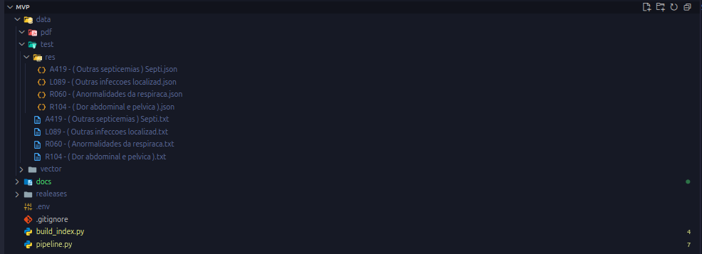

# 🧩 SNOMED CT - International Edition + MVP EBERS

Este repositório combina:

1. Os releases oficiais da **SNOMED CT (International Edition)** em **RF2 (Release Format 2)**.  
2. Um  que processa evoluções médicas e mapeia termos clínicos a partir de texto livre **pdf ou .txt** para **conceitos SNOMED CT**.

---

## 1. Estrutura do Projeto




---

## 2. SNOMED CT

### 2.1 Componentes Principais

- **Terminology**
  - `sct2_Concept` → Conceitos clínicos.
  - `sct2_Description` → Termos e descrições textuais.
  - `sct2_TextDefinition` → Definições detalhadas.
  - `sct2_Relationship` → Relações entre conceitos.
  - `sct2_StatedRelationship` → Relações declaradas.
  - `sct2_RelationshipConcreteValues` → Relações com valores literais/numericos.
  - `sct2_Identifier` → Identificadores alternativos.
  - `sct2_sRefset_OWLExpression` → Ontologia em OWL.

- **Refset**
  - `Content` → Conjuntos de conceitos e atributos.
  - `Language` → Preferências linguísticas (ex.: inglês).
  - `Map` → Mapas para outros sistemas de codificação (ex.: ICD-10).
  - `Metadata` → Estrutura e metadados do modelo (MRCM, tipos de descrição, dependências de módulo).

### 2.2 Versão Disponível

- **International Edition – Agosto 2025**  
  - Release date: `2025-08-01`  
  - Full + Snapshot disponíveis

### 2.3 Como Usar

1. Use arquivos **Snapshot** para apenas o estado atual da terminologia.  
2. Use arquivos **Full** para histórico completo (versionamento).  
3. Arquivos em formato tabular (`.txt`, delimitados por tabulação).

### 2.4 Referências

- [SNOMED International](https://www.snomed.org/snomed-ct)  
- [Release Format 2 (RF2) Guide](https://confluence.ihtsdotools.org/display/DOCRELFMT/1.+Introduction)  

---

## 3. MVP EBERS

### 3.1 Objetivo

Processar textos clínicos (ex.: evoluções médicas, prontuários) e mapear automaticamente termos para **conceitos SNOMED CT** mais próximos, usando IA.

---

### 3.2 Exemplo de Input

A419 - ( Outras septicemias ) Septicemia nao especificada

Evolução HNSC:
MEDICINA INTERNA 
Maria Cecilia Araujo de Oliveira, 84 anos
Registro: 24926612
DI EMER 21/08 | MEI 23/08 | UTI 28/08 | MEI 02/09

PRÉVIO:
FA paroxística
HAS
IC
Ecocardio 21/08: FE 70%. Esclerose valvar aórtica não obstrutiva com regurgitação leve. Ventrículo esquerdo com hipertrofia excêntrica e função sistólica preservada.

Disfunção diastólica grau 1. Mitroesclerose. Regurgitação mitral mínima. Dilatação atrial esquerda. Regurgitação tricúspide mínima
Hipotireoidismo

Tabagista em remissão há 2 meses
MUC: rivaroxabana 20mg/dia, HCTZ 25mg, enalapril 20mg BID, t. metoprolol 100mg BID, sinvastatina 40mg/noite, levotiroxina 50 mcg, salbutamol em crise de dispneia

HDA (21/08): Paciente com queixa de dor torácica em "fincada" do lado direito, com início há 3 dias. Refere crises de dor de aproximadamente 20 minutos, não associada ao esforço físico. Menciona que tem apresentado dispneia associada aos médios esforços. Nega batida, refere alguns estresses.

ATUAL
Dor torácica tipo C/D - provavelmente não anginosa
:: Tropononina sem curva (10,6 -> 11,9)
:: Alterações dinâmicas no ECG: inversão de T em DII, DII e AVF
:: Heart Score 1+1+2+1+0=4
:: Cintilo miocárdica 28/08: Discreta área de hipoatividade ântero-apical de etiologia a ser esclarecida. Não realizou a etapa de estresse a pedido do médico assistente.
Queda hematimétrica por HDA ativa
:: Hb: 12 >11.9>10,6>8,7>8>5,5
;; EDA Sangramento ativo em porejamento em D2 - provável lesão de Dieulafoy - mantendo sangramento ativo mesmo após tratamento endoscópico adequado (2 clipes + escleroterapia)
:: AngioTC na urgencia: retropneumoperitonio -> avaliada pela CG, que indicou tratamento conservador e TC de controle em 48h
:: 3 CHADs desde 27/08
:: Hb recentes: 6,8 -> 7,5 (03/09)
Herpes Zoster identificado em 26/08 -> possivelmente a causa da dor torácica

ATB:
Aciclovir 28/08 - atual
PPTZ 28/08 - atual

SUBJETIVO
Encontro paciente em leito de enfermaria, desacompanhada. Relata melhora completa da dor abdominal e ausência de novas evacuações melenadas. Relata boa aceitação VO. Sem novas queixas.

OBJETIVO
BEG, mucosas hipocoradas, LOC.. Eupneica em aa
SVs 24h PASS 120-130 | FC 74 -79 | Sat > 95% em aa | Afebril HGT 88-106-85 | Diurese presente e evacuações presentes - pastosas. Sem episódios de melena recentes
AC: BNF, RR, 2T, sem sopros
AP: MVUD, SRA, eupneica
ABD: Depressível, globoso, sem dor a palpação superficial ou profunda, não palpo massas ou megalias, sem sinais de peritonismo
EXT: aquecidas e perfundidas, TEC <3s, sem edema ou empastamento de panturrilha]

IMPRESSÃO:
Octogenária com funcionalidades preservadas previamente, interna em contexto de dor torácica atípica e alterações dinâmicas em ECG, sem curva de troponinas - realizada estratificação não invasiva, sem achados conclusivos devido ausência de etapa de estresse. Intercorre com HDA e queda hematimétrica com necessidade de transferência para UTI - sem sucesso em tentativas de hemostase endoscópica. Identificado pneumoretroperitônio pós EDA -> em manejo conservador e sem novas quedas hematimétricas.

Devido a probabilidade intermediária de SCA/DAC, associada ao alto risco de ressangramento com DAPT, optado pelo não seguimento de investigação coronariana

CONDUTA:
Sem necessidade de CHAD por ora - vigio exteriorizações
Mantenho Ferro EV com plano de 5 dias de reposição - D1 03/09
Mantenho omeprazol EV por ora
Aguarda TC para acompanhamento de pneumoretroperitonio
Aguarda consultoria da odontologia
Plano de Labs para sábado

PLANO:
- Discutir necessidade de retorno à anticoagulação plena, visto FA paroxística pouco provável

R1 MEI João Zanata | R2 MEI Fernanda | Eq. Cláudia


Evoluído por: JOAO C Z - CRM: 9999 em 04/09/25 às 12:48


---

### 3.3 Exemplo de Output do MVP

```json
[
  {
    "chunk": "A419 - ( Outras septicemias ) Septicemia nao especificada Evolução HNSC: ### MEDICINA INTERNA ### Maria Cecilia Araujo de Oliveira, 84 anos Registro: 24926612 DI EMER 21/08 | MEI 23/08 | UTI 28/08 | MEI 02/09 PRÉVIO: # FA paroxística # HAS # IC - Ecocardio 21/08: FE 70%. Esclerose valvar aórtica não obstrutiva com regurgitação leve. Ventrículo esquerdo com hipertrofia excêntrica e função sistólica preservada. Disfunção diastólica grau 1. Mitroesclerose. Regurgitação mitral mínima. Dilatação atrial esquerda. Regurgitação tricúspide mínima # Hipotireoidismo # Tabagista em remissão há 2 meses MUC: rivaroxabana 20mg/dia, HCTZ 25mg, enalapril 20mg BID, t. metoprolol 100mg BID, sinvastatina 40mg/noite, levotiroxina 50 mcg, salbutamol em crise de dispneia HDA (21/08): Paciente com queixa de dor torácica em \"fincada\" do lado direito, com início há 3 dias. Refere crises de dor de aproximadamente 20 minutos, não associada ao esforço físico. Menciona que tem apresentado dispneia associada aos médios esforços. Nega batida, refere alguns estresses. ATUAL # Dor torácica tipo C/D - provavelmente não anginosa :: Tropononina sem curva (10,6 -> 11,9) :: Alterações dinâmicas no ECG: inversão de T em DII, DII e AVF :: Heart Score 1+1+2+1+0=4 :: Cintilo miocárdica 28/08: Discreta área de hipoatividade ântero-apical de etiologia a ser esclarecida. Não realizou a etapa de estresse a pedido do médico assistente. # Queda hematimétrica por HDA ativa :: Hb: 12 >11.9>10,6>8,7>8>5,5 ;; EDA Sangramento ativo em porejamento em D2 - provável lesão de Dieulafoy - mantendo sangramento ativo mesmo após tratamento endoscópico adequado (2 clipes + escleroterapia) :: AngioTC na urgencia: retropneumoperitonio -> avaliada pela CG, que indicou tratamento conservador e TC de controle em 48h :: 3 CHADs desde 27/08 :: Hb recentes: 6,8 -> 7,5 (03/09) # Herpes Zoster identificado em 26/08 -> possivelmente a causa da dor torácica ATB: Aciclovir 28/08 - atual",
    "concepts": [
      {
        "conceptId": 201097003,
        "term": "Senile keratoma. Senile keratoma (disorder)"
      },
      {
        "conceptId": 70041004,
        "term": "Erythrokeratodermia variabilis. Erythrokeratodermia variabilis (disorder). Congenital poikiloderma. Mendes da Costa syndrome"
      },
      {
        "conceptId": 720986005,
        "term": "Anhidrotic ectodermal dysplasia, immunodeficiency, osteopetrosis, lymphedema syndrome (disorder). Anhidrotic ectodermal dysplasia, immunodeficiency, osteopetrosis, lymphedema syndrome. Anhidrotic ectodermal dysplasia, immunodeficiency, osteopetrosis, lymphoedema syndrome. OL-EDA-ID (anhidrotic ectodermal dysplasia, immunodeficiency, osteopetrosis, lymphedema) syndrome. OL-EDA-ID (anhidrotic ectodermal dysplasia, immunodeficiency, osteopetrosis, lymphoedema) syndrome"
      },
      {
        "conceptId": 9323009,
        "term": "Septicemia due to E. Coli. Septicemic colibacillosis. E. coli septicemia. Escherichia coli septicemia. E. coli septicaemia. Escherichia coli septicaemia. Septicaemic colibacillosis. Septicaemia due to E. Coli. Septicemia due to Escherichia coli (disorder). Septicemia due to Escherichia coli. Septicaemia due to Escherichia coli"
      },
      {
        "conceptId": 42569002,
        "term": "Familial type 3 hyperlipoproteinemia. Tubo-eruptive xanthoma. Xanthoma tuberosum. Remnant hyperlipoproteinemia. Familial dysbetalipoproteinemia. Broad-beta disease. Floating beta disease. Tuberous xanthoma. Remnant hyperlipoproteinaemia. Primary dysbetalipoproteinaemia. Familial dysbetalipoproteinaemia. Familial type III hyperlipoproteinaemia. Fredrickson type III hyperlipoproteinaemia. Remnant hyperlipidaemia. Familial type III hyperlipoproteinemia. Fredrickson type III hyperlipoproteinemia. Primary dysbetalipoproteinemia. Remnant hyperlipidemia. Broad beta disease. Apolipoprotein E deficiency. Familial type 3 hyperlipoproteinaemia. Familial type 3 hyperlipoproteinemia (disorder)"
      }
    ],
    "diagnostic": "LLM avaliou e escolheu conceito mais próximo"
  },
  {
    "chunk": "PPTZ 28/08 - atual SUBJETIVO Encontro paciente em leito de enfermaria, desacompanhada. Relata melhora completa da dor abdominal e ausência de novas evacuações melenadas. Relata boa aceitação VO. Sem novas queixas. OBJETIVO BEG, mucosas hipocoradas, LOC.. Eupneica em aa SVs 24h PASS 120-130 | FC 74 -79 | Sat > 95% em aa | Afebril HGT 88-106-85 | Diurese presente e evacuações presentes - pastosas. Sem episódios de melena recentes AC: BNF, RR, 2T, sem sopros AP: MVUD, SRA, eupneica ABD: Depressível, globoso, sem dor a palpação superficial ou profunda, não palpo massas ou megalias, sem sinais de peritonismo EXT: aquecidas e perfundidas, TEC <3s, sem edema ou empastamento de panturrilha] IMPRESSÃO: Octogenária com funcionalidades preservadas previamente, interna em contexto de dor torácica atípica e alterações dinâmicas em ECG, sem curva de troponinas - realizada estratificação não invasiva, sem achados conclusivos devido ausência de etapa de estresse. Intercorre com HDA e queda hematimétrica com necessidade de transferência para UTI - sem sucesso em tentativas de hemostase endoscópica. Identificado pneumoretroperitônio pós EDA -> em manejo conservador e sem novas quedas hematimétricas. # Devido a probabilidade intermediária de SCA/DAC, associada ao alto risco de ressangramento com DAPT, optado pelo não seguimento de investigação coronariana CONDUTA: Sem necessidade de CHAD por ora - vigio exteriorizações Mantenho Ferro EV com plano de 5 dias de reposição - D1 03/09 Mantenho omeprazol EV por ora Aguarda TC para acompanhamento de pneumoretroperitonio Aguarda consultoria da odontologia Plano de Labs para sábado PLANO: - Discutir necessidade de retorno à anticoagulação plena, visto FA paroxística pouco provável R1 MEI João Zanata | R2 MEI Fernanda | Eq. Cláudia Evoluído por: JOAO VITOR MARTINELLI ZANATA - CRM: 59497 em 04/09/25 às 12:48",
    "concepts": [
      {
        "conceptId": 80319003,
        "term": "Cholecystojejunostomy. Cholecystojejunostomy (procedure)"
      },
      {
        "conceptId": 733150001,
        "term": "Diverticulitis of small intestine with perforation and abscess. Perforation and abscess of small intestine co-occurrent and due to diverticulitis (disorder). Perforation and abscess of small intestine co-occurrent and due to diverticulitis"
      },
      {
        "conceptId": 40271000119102,
        "term": "Hemorrhage of small intestine due to diverticulosis. Haemorrhage of small intestine due to diverticulosis. Hemorrhage of small intestine co-occurrent and due to diverticulosis (disorder). Hemorrhage of small intestine with diverticulosis. Haemorrhage of small intestine with diverticulosis. Haemorrhage of small intestine co-occurrent and due to diverticulosis. Hemorrhage of small intestine co-occurrent and due to diverticulosis"
      },
      {
        "conceptId": 722855007,
        "term": "Perforation and abscess of large intestine co-occurrent and due to diverticulitis (disorder). Perforation and abscess of large intestine co-occurrent and due to diverticulitis. Perforation and abscess of large intestine due to diverticulitis"
      },
      {
        "conceptId": 1086481000119105,
        "term": "Perforation of small intestine co-occurrent with hemorrhage due to diverticulitis (disorder). Perforation of small intestine co-occurrent with haemorrhage due to diverticulitis. Perforation of small intestine co-occurrent with hemorrhage due to diverticulitis"
      }
    ],
    "diagnostic": "LLM avaliou e escolheu conceito mais próximo"
  }
]
