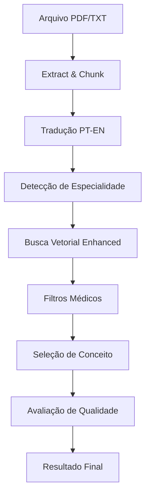

# Arquitetura do Sistema de Diagnóstico Médico com SNOMED CT

## 📁 Estrutura de Diretórios

```
papiro_de_ebers/
├── src/                          # Código fonte organizado
│   ├── core/                     # Módulos centrais
│   │   ├── __init__.py
│   │   ├── config.py             # Configurações centralizadas
│   │   ├── medical_translator.py # Tradutor PT-EN
│   │   └── medical_filters.py    # Filtros médicos
│   ├── pipelines/                # Pipelines de processamento
│   │   ├── enhanced_pipeline.py  # Pipeline principal enhanced
│   │   └── build_enhanced_index.py # Construtor de índice
│   └── evaluation/               # Sistema de avaliação
│       ├── quality_assessor.py   # Avaliador de qualidade
│       └── enhanced_evaluator.py # Avaliador enhanced
├── data/                         # Dados do sistema
│   ├── vector/                   # Índices FAISS e conceitos
│   └── test/                     # Arquivos de teste
│       └── res/                  # Resultados
├── docs/                         # Documentação
│   └── architecture/             # Documentação de arquitetura
├── main.py                       # Script principal
└── requirements.txt              # Dependências
```

## 🔧 Componentes Principais

### 1. **Core Module** (`src/core/`)

#### `config.py`
- **Função**: Configurações centralizadas do sistema
- **Recursos**:
  - Caminhos de diretórios
  - Configurações do SNOMED CT
  - Parâmetros do FAISS
  - Thresholds de qualidade

#### `medical_translator.py`
- **Função**: Tradução português-inglês para termos médicos
- **Recursos**:
  - Dicionário com 200+ termos médicos
  - Padrões de tradução complexos
  - Extração de palavras-chave médicas

#### `medical_filters.py`
- **Função**: Filtros médicos especializados
- **Recursos**:
  - Detecção de especialidades médicas
  - Filtros de conceitos SNOMED
  - Scoring de relevância

### 2. **Pipelines Module** (`src/pipelines/`)

#### `enhanced_pipeline.py`
- **Função**: Pipeline principal de processamento
- **Recursos**:
  - Processamento de PDF/TXT
  - Tradução automática
  - Busca vetorial enhanced
  - Avaliação de qualidade

#### `build_enhanced_index.py`
- **Função**: Construtor de índice FAISS
- **Recursos**:
  - Filtros de conceitos médicos relevantes
  - Amostragem inteligente (50.000 conceitos)
  - Treinamento otimizado do índice

### 3. **Evaluation Module** (`src/evaluation/`)

#### `quality_assessor.py`
- **Função**: Avaliação de qualidade dos mapeamentos
- **Recursos**:
  - Critérios clínicos realistas
  - Scoring por especialidade
  - Justificativas detalhadas

#### `enhanced_evaluator.py`
- **Função**: Avaliador enhanced dos resultados
- **Recursos**:
  - Comparação com versões anteriores
  - Métricas de precisão
  - Relatórios detalhados

## 🔄 Fluxo de Processamento



## 📊 Score de Qualidade - Explicação Detalhada

### **De onde vem o Score de Qualidade?**

O **Score de Qualidade** é calculado pela classe `QualityAssessor` em `src/evaluation/quality_assessor.py`:

#### **1. Critérios por Especialidade**
```python
quality_criteria = {
    "cardiology": {
        "primary_conditions": ["myocardial infarction", "angina", "heart failure"],
        "secondary_conditions": ["arrhythmia", "tachycardia", "ischemia"],
        "keywords": ["infarto", "cardíaco", "coração", "angina"],
        "weight_primary": 4.0,
        "weight_secondary": 2.0,
        "weight_keywords": 1.0
    }
}
```

#### **2. Cálculo do Score**
- **Relevância (0-1)**: Baseada em palavras-chave e condições médicas
- **Adequação (0-1)**: Baseada no contexto clínico específico
- **Score Final (0-10)**: `(relevância + adequação) * 5`

#### **3. Justificativas**
- **8-10**: "Excelente mapeamento - conceito altamente relevante"
- **6-8**: "Bom mapeamento - conceito relevante com boa adequação"
- **4-6**: "Mapeamento regular - conceito parcialmente relevante"
- **2-4**: "Mapeamento fraco - conceito pouco relevante"
- **0-2**: "Mapeamento inadequado - conceito não relevante"

## 🚀 Como Executar

### **1. Execução Completa**
```bash
python main.py
```

### **2. Execução Individual**
```bash
# Construir índice
python src/pipelines/build_enhanced_index.py

# Executar pipeline
python src/pipelines/enhanced_pipeline.py

# Avaliar resultados
python src/evaluation/enhanced_evaluator.py
```

## 📈 Melhorias Implementadas

### **1. Expansão de Conceitos**
- **Antes**: 10.000 conceitos
- **Agora**: 50.000 conceitos (5x mais)

### **2. Tradução Português-Inglês**
- Dicionário médico com 200+ termos
- Padrões de tradução complexos
- Melhor matching com SNOMED CT

### **3. Sistema de Qualidade Melhorado**
- Critérios clínicos realistas
- Scoring por especialidade
- Justificativas detalhadas

### **4. Arquitetura Organizada**
- Separação clara de responsabilidades
- Módulos reutilizáveis
- Documentação completa

## 🔍 Monitoramento e Debugging

### **Logs do Sistema**
- `🔹`: Inicialização
- `✅`: Sucesso
- `⚠️`: Aviso
- `❌`: Erro
- `📊`: Estatísticas
- `🔤`: Tradução
- `🏥`: Especialidade médica

### **Arquivos de Resultado**
- `*_enhanced_v2.json`: Resultados com avaliação de qualidade
- Inclui: conceito selecionado, scores, justificativas, especialidade

## 🎯 Próximos Passos

1. **Validação Clínica**: Testar com médicos reais
2. **Expansão de Termos**: Adicionar mais termos médicos
3. **Interface Web**: Criar interface para uso clínico
4. **Integração**: Conectar com sistemas hospitalares
5. **Machine Learning**: Implementar modelos de ML para melhorar precisão
